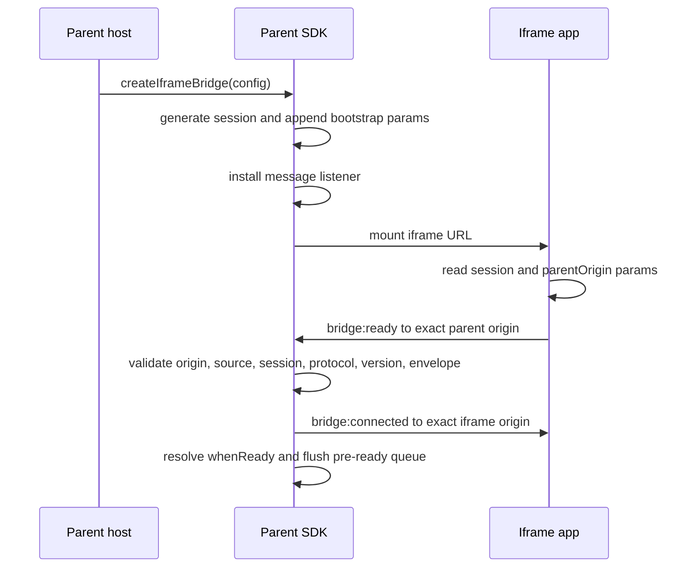

# Getting Started

This guide gets you from an empty file to a working iframe bridge with typed request/response and event communication. You'll need a parent page (where the SDK runs) and an iframe application that follows the [wire protocol](./wire-protocol).

---

## Install

The SDK ships as a single ESM package with zero runtime dependencies.

```bash npm2yarn
npm install iframe-helper-sdk
```

```bash
pnpm add iframe-helper-sdk
```

TypeScript types are included — no separate `@types/` package needed. The runtime payload is about **2 KB gzipped** and tree-shakable.

---

## Create Your First Bridge

Import the factory and call it with the two required options: a mount target and an iframe URL.

```ts
import { createIframeBridge } from 'iframe-helper-sdk';

const bridge = createIframeBridge({
  container: '#partner-frame',
  src: 'https://partner.example/app',
});
```

That's it. The SDK creates an iframe element, appends bootstrap parameters to the URL, mounts it into `#partner-frame`, and begins listening for the iframe's handshake.

### What's happening under the hood

1. The SDK generates a random **session id** — a correlation value (not a secret, not authentication).
2. It appends `__iframeBridgeSessionId` and `__iframeBridgeParentOrigin` to the iframe URL as query parameters.
3. It installs a `message` event listener on the window.
4. It mounts the iframe and starts a 10-second handshake timer.
5. When the iframe sends `bridge:ready`, the bridge becomes operational.

:::tip[See it run]

The repository includes a working cross-origin playground under `playground/manual/`. The parent page imports the SDK and the iframe page implements the raw protocol directly — no SDK on the iframe side.

```bash
npm run build
npm run example:manual:parent
npm run example:manual:iframe
```

Open `http://127.0.0.1:5173/` in your browser.
:::

---

## Understanding the Handshake

The bridge uses a **ready-first handshake**. The parent does not send `bridge:init` — it waits for the iframe to declare readiness.



### Awaiting readiness

```ts
await bridge.whenReady();
console.log('Bridge is ready');
```

- Resolves when the first valid `bridge:ready` is accepted (or immediately if already ready).
- Rejects with `HANDSHAKE_TIMEOUT` if the iframe doesn't respond within `bootstrap.handshakeTimeoutMs` (default: 10 seconds).
- Rejects with `BRIDGE_DESTROYED` if the bridge is destroyed before readiness.

You can start communicating before readiness — see the [queue behavior](#message-queueing) below.

---

## Your First Request / Response

Once the bridge is ready, call `bridge.request()` to send a request to the iframe and wait for its response.

```ts
try {
  const user = await bridge.request<{ id: string }, { name: string }>('user:get', { id: '123' });
  console.log(user.name);
} catch (error) {
  if (error instanceof IframeBridgeError) {
    console.error(error.code, error.details);
  }
}
```

### How requests work

- The parent sends a `bridge:request` envelope with a unique `requestId`.
- The iframe processes the request and responds with a `bridge:response` envelope carrying the same `requestId`.
- The parent resolves the promise with the response payload.
- Only the **first** response for each `requestId` is accepted — duplicates are ignored.

### Error handling

Every API that can fail throws an `IframeBridgeError` with a structured `code` property:

| Error code             | Meaning                                                                                  |
| ---------------------- | ---------------------------------------------------------------------------------------- |
| `REQUEST_TIMEOUT`      | The iframe didn't respond before the operation timeout.                                  |
| `REQUEST_REMOTE_ERROR` | The iframe responded with an explicit error object. Inspect `error.details.remoteError`. |
| `OPERATION_ABORTED`    | The `AbortSignal` you provided was triggered.                                            |
| `BRIDGE_NOT_READY`     | Queueing is disabled and you called a method before readiness.                           |
| `BRIDGE_DESTROYED`     | The bridge was destroyed while the operation was pending.                                |

See the full reference: [Error Codes](./error-codes).

---

## Sending Events (Fire-and-Forget)

Use `sendEvent()` for one-way notifications where you don't need a response from the iframe.

```ts
await bridge.sendEvent<{ action: string }>('analytics:track', {
  action: 'opened',
});
```

The promise resolves when the message is **posted** — it does not prove the iframe processed it. If you need acknowledgment, use `request()` instead.

:::warning

Aborting a `sendEvent()` only cancels the local post. The message may already have been delivered. Use `request()` when you need a confirmed outcome.
:::

---

## Listening for Events from the Iframe

The iframe can send events to the parent at any time after the handshake. You have two ways to listen:

### Continuous listener (`on`)

```ts
const unsubscribe = bridge.on<{ itemCount: number }>('cart:changed', (payload) => {
  console.log(payload.itemCount);
});

// Later: stop listening
unsubscribe();
```

- Registers a callback that fires every time the iframe sends a matching event.
- Returns an unsubscribe function — call it to clean up.
- Can be registered **before** the bridge is ready (inbound events are dispatched once the bridge is ready).
- No timeout semantics — runs until you unsubscribe or the bridge is destroyed.

### One-shot waiter (`waitForEvent`)

```ts
const status = await bridge.waitForEvent<{ ready: boolean }>('app:status', { timeoutMs: 3000 });
console.log(status.ready);
```

- Resolves with the **next** matching event payload after the waiter is active.
- Rejects with `EVENT_WAIT_TIMEOUT` if no matching event arrives before the timeout.
- Use this when you expect a single event in response to a known action.

---

## Type-Safe Bridge (Teaser)

For integrations with many methods, per-call generics can get repetitive. `createTypedIframeBridge` lets you define a **contract map** once and get full TypeScript narrowing everywhere:

```ts
import { createTypedIframeBridge } from 'iframe-helper-sdk';

type Contract = {
  requests: {
    'user:get': { payload: { id: string }; response: { name: string } };
  };
  outboundEvents: {
    'analytics:track': { action: string };
  };
  inboundEvents: {
    'cart:changed': { itemCount: number };
  };
};

const bridge = createTypedIframeBridge<Contract>({
  container: '#partner-frame',
  src: 'https://partner.example/app',
});

await bridge.whenReady();

const user = await bridge.request('user:get', { id: '123' });
//      ^ typed as { name: string }

await bridge.sendEvent('analytics:track', { action: 'opened' });
//      ^ only accepts { action: string }

bridge.on('cart:changed', (payload) => {
  //                ^ typed as { itemCount: number }
  console.log(payload.itemCount);
});
```

This is **compile-time only** — the runtime wire protocol is identical to `createIframeBridge`. No runtime schema validation, no additional bytes. Learn more: [Type-Safe Bridge](./typed-bridge).

---

## Iframe Application Minimum

The iframe does **not** need to import this SDK. It implements the raw protocol directly. Here's what the iframe side must do:

```ts
// 1. Read bootstrap parameters from the URL
const params = new URLSearchParams(window.location.search);
const sessionId = params.get('__iframeBridgeSessionId');
const parentOrigin = params.get('__iframeBridgeParentOrigin');

// 2. Send bridge:ready to the parent
window.parent.postMessage(
  { protocol: 'iframe-bridge', version: 1, sessionId, type: 'bridge:ready' },
  parentOrigin,
);

// 3. Listen for parent messages
window.addEventListener('message', (event) => {
  if (event.origin !== parentOrigin) return;
  const msg = event.data;
  if (msg?.protocol !== 'iframe-bridge' || msg?.sessionId !== sessionId) return;

  switch (msg.type) {
    case 'bridge:connected':
      console.log('Connected!');
      break;
    case 'bridge:request':
      // Process request, send bridge:response back
      window.parent.postMessage(
        {
          protocol: 'iframe-bridge',
          version: 1,
          sessionId,
          type: 'bridge:response',
          requestId: msg.requestId,
          payload: { name: 'Ada' },
        },
        parentOrigin,
      );
      break;
  }
});
```

Full protocol specification: [Wire Protocol](./wire-protocol).

---

## Message Queueing

If you call `request()`, `sendEvent()`, or `waitForEvent()` before the bridge is ready, those operations are queued automatically and flushed once the handshake completes:

```ts
const bridge = createIframeBridge({ container: '#root', src: 'https://partner.example/app' });

// These are queued — no need to await whenReady() first
const userPromise = bridge.request('user:get', { id: '123' });
bridge.sendEvent('analytics:track', { action: 'page-load' });

// Both execute after the iframe sends bridge:ready
const user = await userPromise;
```

The queue is bounded (default: 50 operations). If the queue is full, new operations reject with `QUEUE_LIMIT_EXCEEDED`. You can disable queueing entirely with `queue.enabled: false` if you prefer strict lifecycle control.

---

## Configuration at a Glance

The examples above use the bare minimum. Here are the most common options you'll reach for next:

| Option                         | Purpose                                                                             |
| ------------------------------ | ----------------------------------------------------------------------------------- |
| `container`                    | DOM element or selector where the iframe is mounted.                                |
| `src`                          | HTTPS URL loaded into the iframe (localhost HTTP allowed in dev).                   |
| `targetOrigin`                 | Exact origin for parent-to-iframe messages. Defaults to `src.origin`.               |
| `allowedOrigin`                | Exact origin accepted for iframe-to-parent messages. Defaults to `src.origin`.      |
| `bootstrap.handshakeTimeoutMs` | Max wait for `bridge:ready` (default: 10000).                                       |
| `timeouts.operationTimeoutMs`  | Default timeout for requests and event waits (default: 5000).                       |
| `sandbox`                      | Iframe sandbox attribute for capability restriction.                                |
| `securityProfile`              | `'strict'` for production fail-fast checks, `'development'` (default) for warnings. |

Optional plugins, such as `resizePlugin()` from `iframe-helper-sdk/resize`, are registered through the second factory argument. See [Plugins](./plugins).

Full reference with every option: [Configuration](./configuration).

---

## Next Steps

- **[Core Concepts](./core-concepts)** — Deep dive into the lifecycle, handshake, and communication patterns.
- **[Configuration](./configuration)** — Every option, grouped by category, with defaults and use cases.
- **[Plugins](./plugins)** — Add optional tree-shakable behavior such as child-driven resize.
- **[Type-Safe Bridge](./typed-bridge)** — Define a contract map once, get full TypeScript narrowing everywhere.
- **[Use Cases & Recipes](./use-cases)** — Copy-pasteable config recipes for production, development, sandboxing, and more.
- **[Debugging & Diagnostics](./debugging)** — Plug in diagnostic recorders and logger hooks for visibility.

Or jump back to the [**Home page**](/) for a feature overview.
