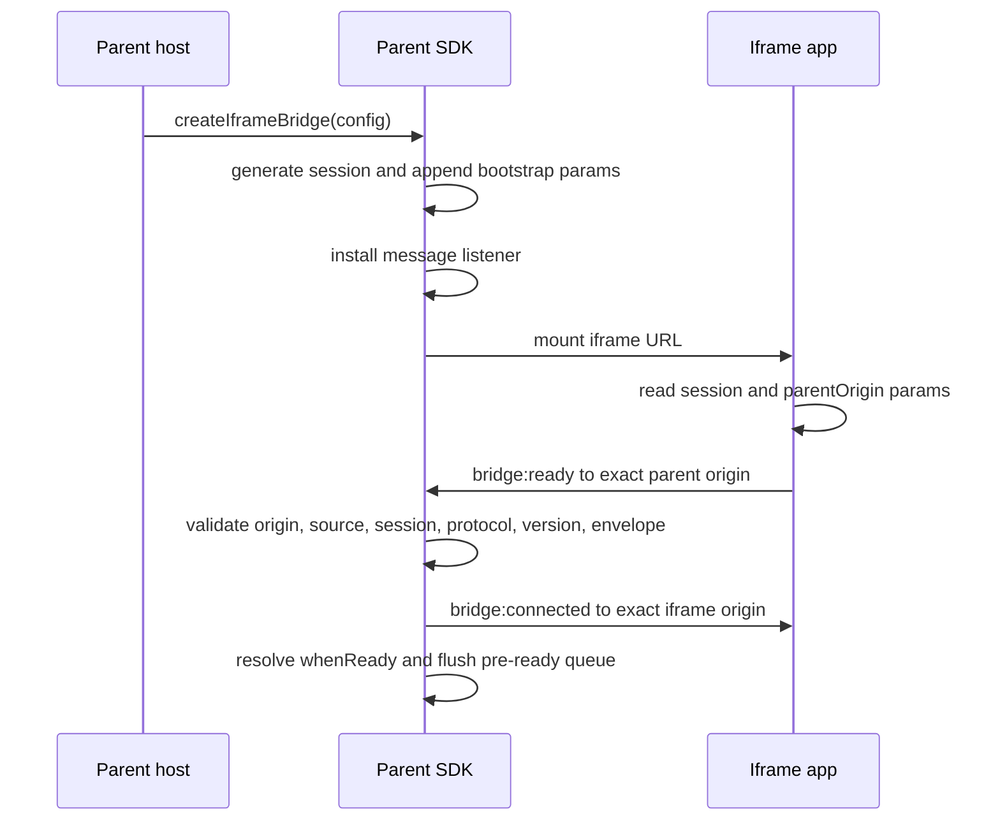

# Wire Protocol

The iframe bridge SDK communicates through a typed `postMessage` protocol. The SDK handles the parent side automatically. If you're building an **iframe application** (the page loaded inside the iframe), this page tells you exactly what messages to send, what structure they have, and what validation the parent expects.

Your iframe app does **not** need to import this SDK. You implement the protocol directly against `window.parent.postMessage()` and `window.addEventListener('message', …)`. The [playground iframe](https://github.com/anomalyco/iframe-helper-sdk) in the repository shows a complete working example in ~100 lines of vanilla JavaScript.

---

## Envelope

Every protocol message is a plain JSON-serializable object with this shape. The fields `protocol`, `version`, `sessionId`, and `type` are present on every message. Variant-specific fields depend on the `type`.

```ts
type BridgeEnvelope =
  | {
      protocol: 'iframe-bridge';
      version: 1;
      sessionId: string;
      type: 'bridge:ready';
    }
  | {
      protocol: 'iframe-bridge';
      version: 1;
      sessionId: string;
      type: 'bridge:connected';
    }
  | {
      protocol: 'iframe-bridge';
      version: 1;
      sessionId: string;
      type: 'bridge:event';
      name: string;
      payload?: unknown;
    }
  | {
      protocol: 'iframe-bridge';
      version: 1;
      sessionId: string;
      type: 'bridge:request';
      requestId: string;
      name: string;
      payload?: unknown;
    }
  | {
      protocol: 'iframe-bridge';
      version: 1;
      sessionId: string;
      type: 'bridge:response';
      requestId: string;
      payload?: unknown;
      error?: {
        code: string;
        message: string;
        data?: unknown;
      };
    };
```

### Base fields (every message)

| Field       | Type                | Description                                                                                                                                                            |
| ----------- | ------------------- | ---------------------------------------------------------------------------------------------------------------------------------------------------------------------- |
| `protocol`  | `'iframe-bridge'`   | Protocol namespace. Messages with any other value are silently ignored.                                                                                                |
| `version`   | `1`                 | Protocol version. The parent rejects versions other than `1`.                                                                                                          |
| `sessionId` | `string`            | Correlation value from the iframe URL (`__iframeBridgeSessionId`). Must be non-empty and match the parent's session. Not a secret — treat it as routing metadata only. |
| `type`      | `BridgeMessageType` | One of five message types (see below). Unknown types are rejected.                                                                                                     |

The parent validates **all four** base fields before inspecting any variant-specific fields. If any base field is missing, wrong, or invalid, the message is treated as `MESSAGE_INVALID_ENVELOPE` and discarded.

### Variant-specific fields

| field       | Required on                         | Description                                                                                                                     |
| ----------- | ----------------------------------- | ------------------------------------------------------------------------------------------------------------------------------- |
| `name`      | `bridge:event`, `bridge:request`    | Application-level event or request name. Must be a non-empty string.                                                            |
| `requestId` | `bridge:request`, `bridge:response` | Unique id that pairs a request with its response. Must be a non-empty string.                                                   |
| `payload`   | All (optional)                      | Application data. Must be [structured-cloneable](#structured-clone-data). Optional on all message types.                        |
| `error`     | `bridge:response` (optional)        | Remote error object. When present, `code` and `message` must be non-empty strings. `data` is optional and preserved if present. |

:::warning
The parent SDK enforces these validation rules at runtime. A message that passes your hand-rolled `isBridgeEnvelope()` check may still be rejected if `name` is empty on an event, `requestId` is missing on a request, or the remote error `code` or `message` is empty.
:::

---

## Message Types

The protocol has exactly five message types. The parent SDK exports them as `BRIDGE_MESSAGE_TYPES` for reference.

| Type               | Direction       | Purpose                                                                     |
| ------------------ | --------------- | --------------------------------------------------------------------------- |
| `bridge:ready`     | Iframe → Parent | "I am loaded and ready to communicate." Starts the handshake.               |
| `bridge:connected` | Parent → Iframe | "Handshake accepted." Sent exactly once after the first valid ready.        |
| `bridge:event`     | Both            | Fire-and-forget named event with optional payload.                          |
| `bridge:request`   | Parent → Iframe | Named operation that expects a `bridge:response` with the same `requestId`. |
| `bridge:response`  | Iframe → Parent | Response to a parent-initiated request. May carry a payload or an error.    |

:::note
The parent SDK does not handle iframe-initiated `bridge:request` in the current version. The envelope type is reserved in the protocol for future use, but MVP behavior only supports parent-to-iframe requests.
:::

---

## Handshake Sequence

The bridge uses a **ready-first handshake**. The parent does not send an initiation message — it waits for the iframe to declare readiness.



### Step by step

1. **Parent generates a session id** and appends it to the iframe URL as a query or hash parameter (default: `__iframeBridgeSessionId` in the query string).
2. **Parent appends its own origin** as a separate parameter (default: `__iframeBridgeParentOrigin` in the query string). This tells your iframe app exactly where to send `bridge:ready`.
3. **Parent installs a `message` event listener** before mounting the iframe — no message can arrive before the listener exists.
4. **Parent mounts the iframe** and starts a handshake timer (default: 10 seconds, configurable via `bootstrap.handshakeTimeoutMs`).
5. **Your iframe app reads the bootstrap parameters** from its URL and sends `bridge:ready` to the exact parent origin.
6. **Parent validates the ready message** against origin, source window, session id, protocol name, version, and envelope shape. If validation fails, the message is ignored and the timer keeps ticking.
7. **Parent sends `bridge:connected` exactly once** to the iframe, marks the bridge as ready, and immediately flushes any queued operations.

:::tip[Why ready-first?]
Ready-first eliminates duplicate `bridge:init` risk, keeps the protocol minimal, and makes it safe to mount multiple iframes simultaneously — each one independently declares readiness. See [Core Concepts](./core-concepts#handshake) for the full rationale.
:::

### The iframe's job during handshake

Your iframe application must:

1. Read the session id from the URL (check which parameter name and location the parent configured).
2. Read the parent origin from the URL (or from your own trusted allowlist — never blindly trust a URL parameter).
3. Send `bridge:ready` to that exact parent origin via `postMessage()`.
4. Optionally wait for `bridge:connected` if your app logic depends on parent-side acceptance.

```js
// Minimum iframe handshake implementation
const params = new URLSearchParams(window.location.search);
const sessionId = params.get('__iframeBridgeSessionId');
const parentOrigin = params.get('__iframeBridgeParentOrigin');

if (sessionId && parentOrigin) {
  window.parent.postMessage(
    { protocol: 'iframe-bridge', version: 1, sessionId, type: 'bridge:ready' },
    parentOrigin,
  );
}
```

If the iframe does not send a valid `bridge:ready` before the parent's handshake timeout, the parent bridge enters `handshake_failed` state and all queued operations reject.

---

## Message Details

### `bridge:ready`

**Direction:** Iframe → Parent  
**Fields:** `protocol`, `version`, `sessionId`, `type`  
**Validation:** Parent checks origin, source, session id, protocol, version, and envelope shape.

The first message your iframe sends. No payload. The parent accepts exactly one valid ready per bridge instance. Subsequent `bridge:ready` messages are silently ignored — they do not re-trigger `bridge:connected`, re-flush the queue, or change state.

```js
window.parent.postMessage(
  { protocol: 'iframe-bridge', version: 1, sessionId, type: 'bridge:ready' },
  parentOrigin,
);
```

### `bridge:connected`

**Direction:** Parent → Iframe  
**Fields:** `protocol`, `version`, `sessionId`, `type`  
**Validation (on iframe side):** Check `event.origin`, envelope validity, and `sessionId`.

The parent sends this exactly once after accepting `bridge:ready`. Use it as a signal that the bridge is fully established and queued parent operations have been flushed.

```js
window.addEventListener('message', (event) => {
  if (event.origin !== parentOrigin) return;
  const envelope = event.data;
  if (envelope?.type === 'bridge:connected') {
    console.log('Bridge established');
    // Safe to start sending application events
  }
});
```

### `bridge:event`

**Direction:** Both  
**Fields:** `protocol`, `version`, `sessionId`, `type`, `name`, `payload?`  
**Validation:** `name` must be a non-empty string. `payload` is optional.

Fire-and-forget named events. No response expected. The parent SDK provides `sendEvent()` (outbound), `on()` (continuous listener), and `waitForEvent()` (one-shot waiter) for events.

**Sending events from the iframe:**

```js
window.parent.postMessage(
  {
    protocol: 'iframe-bridge',
    version: 1,
    sessionId,
    type: 'bridge:event',
    name: 'cart:changed',
    payload: { itemCount: 3 },
  },
  parentOrigin,
);
```

**Receiving events from the parent:**

```js
if (envelope.type === 'bridge:event') {
  console.log(`Parent sent event ${envelope.name}`, envelope.payload);
}
```

#### Reserved resize event

The `resizePlugin()` exported from `iframe-helper-sdk/resize` claims the `iframe-bridge:resize` event name for opt-in iframe resizing. When the parent registers the plugin, the SDK consumes this event and applies pixel dimensions to the owned iframe element. Claimed plugin events are not dispatched to user `bridge.on()` listeners.

```js
postToParent({
  type: 'bridge:event',
  name: 'iframe-bridge:resize',
  payload: { width: 800, height: 640 },
});
```

Payload fields, with at least one dimension required:

| Field    | Type     | Description                                  |
| -------- | -------- | -------------------------------------------- |
| `width`  | `number` | Requested iframe width in pixels. Optional.  |
| `height` | `number` | Requested iframe height in pixels. Optional. |

The parent validates the normal envelope first: origin, source window, session id, protocol, version, and envelope shape. Then it validates the resize payload. Invalid resize payloads are ignored and may emit a `RESIZE_INVALID_PAYLOAD` diagnostic when the parent configured diagnostics.

The iframe sends content dimensions only. Parent-side axis filtering, offsets, min/max bounds, and `resizePlugin({ onResize })` run inside the SDK after envelope validation.

Full setup and security guidance: [Resize Plugin](./plugins/resize).

### `bridge:request`

**Direction:** Parent → Iframe (MVP)  
**Fields:** `protocol`, `version`, `sessionId`, `type`, `requestId`, `name`, `payload?`  
**Validation:** `requestId` and `name` must be non-empty strings. `payload` is optional.

The parent sends a named operation and expects a `bridge:response` with the same `requestId`. Your iframe must respond to every request — either with a successful payload or an error object.

```js
if (envelope.type === 'bridge:request') {
  if (envelope.name === 'user:get') {
    // Success response
    window.parent.postMessage(
      {
        protocol: 'iframe-bridge',
        version: 1,
        sessionId,
        type: 'bridge:response',
        requestId: envelope.requestId,
        payload: { id: envelope.payload?.id, name: 'Ada' },
      },
      parentOrigin,
    );
  } else {
    // Error response
    window.parent.postMessage(
      {
        protocol: 'iframe-bridge',
        version: 1,
        sessionId,
        type: 'bridge:response',
        requestId: envelope.requestId,
        error: {
          code: 'UNKNOWN_METHOD',
          message: `Unknown method ${envelope.name}`,
        },
      },
      parentOrigin,
    );
  }
}
```

### `bridge:response`

**Direction:** Iframe → Parent  
**Fields:** `protocol`, `version`, `sessionId`, `type`, `requestId`, `payload?`, `error?`  
**Validation:** `requestId` must be a non-empty string. If `error` is present, `error.code` and `error.message` must be non-empty strings.

Your iframe's reply to a parent request. Include `payload` for successful responses or `error` for failures — never both. The parent maps `error` responses to `REQUEST_REMOTE_ERROR` and exposes the normalized error on `error.details.remoteError`.

**Remote error shape:**

| Field     | Type      | Required | Description                                                                   |
| --------- | --------- | -------- | ----------------------------------------------------------------------------- |
| `code`    | `string`  | Yes      | Machine-readable error code (e.g., `'UNKNOWN_METHOD'`, `'VALIDATION_ERROR'`). |
| `message` | `string`  | Yes      | Human-readable description.                                                   |
| `data`    | `unknown` | No       | Optional error context. Preserved as-is.                                      |

:::note
The parent only accepts the **first response** for each `requestId`. If your iframe responds twice to the same request, the second response is silently ignored.
:::

---

## Iframe Integration Guide

This is the minimum implementation your iframe application needs to successfully handshake and communicate with the parent bridge. For a complete working example, see `playground/manual/iframe/index.html` in the repository.

### 1. Read bootstrap parameters

The parent appends two parameters to your iframe URL. Read them from `window.location.search` (default) or `window.location.hash` (if the parent configured `location: 'hash'`).

| Parameter     | Default name                 | Value                                                                                |
| ------------- | ---------------------------- | ------------------------------------------------------------------------------------ |
| Session id    | `__iframeBridgeSessionId`    | Random correlation string. Echo it on every message you send.                        |
| Parent origin | `__iframeBridgeParentOrigin` | The exact origin you must target with `postMessage()` (e.g., `https://example.com`). |

```js
const params = new URLSearchParams(window.location.search);
const sessionId = params.get('__iframeBridgeSessionId');
const parentOrigin = params.get('__iframeBridgeParentOrigin');
```

:::warning
The parent origin parameter is a URL value placed there by the parent page. Treat it as a hint for routing, not as proof of the parent's identity. If your iframe app has a known set of allowed embedders, verify the parent origin against your own allowlist before sending messages.
:::

### 2. Send `bridge:ready`

Send this as early as your app is ready — but only if both bootstrap parameters are present. A missing session id or parent origin means the iframe was loaded without the bridge SDK, and you should not attempt to communicate.

```js
if (sessionId && parentOrigin) {
  window.parent.postMessage(
    { protocol: 'iframe-bridge', version: 1, sessionId, type: 'bridge:ready' },
    parentOrigin,
  );
}
```

### 3. Listen for parent messages

Install a `message` event listener. Validate every incoming message: check `event.origin`, then check that the data is a valid bridge envelope with your expected `sessionId`.

```js
window.addEventListener('message', (event) => {
  // Reject messages from unexpected origins
  if (event.origin !== parentOrigin) return;

  const envelope = event.data;

  // Reject non-bridge messages
  if (
    typeof envelope !== 'object' ||
    envelope === null ||
    envelope.protocol !== 'iframe-bridge' ||
    envelope.version !== 1 ||
    envelope.sessionId !== sessionId
  ) {
    return;
  }

  // Route by type
  switch (envelope.type) {
    case 'bridge:connected':
      // Handshake accepted
      break;
    case 'bridge:event':
      // Handle parent event
      break;
    case 'bridge:request':
      // Handle parent request and respond
      break;
  }
});
```

### 4. Include the session id on every outgoing message

Every message from your iframe must include the exact `sessionId` from the URL and target the correct `parentOrigin`:

```js
function postToParent(message) {
  window.parent.postMessage(
    {
      protocol: 'iframe-bridge',
      version: 1,
      sessionId,
      ...message,
    },
    parentOrigin,
  );
}
```

### 5. Handle requests and send error responses

The parent can send `bridge:request` messages. Always respond — even for unknown methods — so the parent doesn't time out. Use the error shape for failures.

### 6. Treat the session id as correlation only

The session id is not authentication, not a token, and not a secret. It exists so the parent can route messages to the correct bridge instance when multiple iframes are mounted. Never use it for authorization decisions.

### 7. Wait for `bridge:connected` (optional)

If your app logic depends on knowing the parent has accepted the handshake, wait for `bridge:connected` before sending application-level events:

```js
let connected = false;

// In your message handler:
if (envelope.type === 'bridge:connected') {
  connected = true;
  // Now safe to send application messages
}
```

This is optional — the parent will queue pre-ready operations regardless.

### 8. Send resize events when the parent registered the resize plugin (optional)

If the parent has registered `resizePlugin()`, send `iframe-bridge:resize` after `bridge:connected` and whenever your content dimensions change. See [Resize Plugin](./plugins/resize#iframe-example-with-resizeobserver) for a `ResizeObserver` example.

---

## Structured Clone Data

The browser's `postMessage` API uses the [structured clone algorithm](https://developer.mozilla.org/en-US/docs/Web/API/Web_Workers_API/Structured_clone_algorithm) to transfer data. Your payloads must be structured-cloneable.

### Works

- Primitives: `string`, `number`, `boolean`, `null`, `undefined`
- Plain objects and arrays
- `Date`, `RegExp`
- `Map`, `Set`
- `ArrayBuffer`, `Uint8Array`, and other typed arrays
- `Blob`, `File`

### Doesn't work

- Functions
- DOM nodes
- Class instances (prototype chain is lost — received as plain objects)
- Symbols
- Properties with private fields (`#private`)
- `Error` objects (receive as `{}` — use `{ code, message }` instead)
- `WeakMap`, `WeakSet`

```js
// fine — plain data
postToParent({ type: 'bridge:event', name: 'cart:changed', payload: { itemCount: 3 } });

// fine — arrays, Dates, Maps
postToParent({
  type: 'bridge:event',
  name: 'report',
  payload: { items: ['a', 'b'], createdAt: new Date() },
});

// broken — includes a function
postToParent({ type: 'bridge:event', name: 'bad', payload: { onClick() {} } });
// → structured clone throws DataCloneError
```

:::tip
Serialize complex values before posting (e.g., `error.message` instead of the `Error` object itself). The remote error shape (`{ code, message, data? }`) is designed so you never need to send an `Error` instance.
:::

---

## Duplicate Handling

The protocol defines clear rules for handling repeated or late messages. The parent SDK enforces these on the parent side — your iframe app should follow the same principles.

### Duplicate `bridge:ready`

The parent accepts **only the first valid `bridge:ready`** per bridge instance. Duplicate ready messages:

- Do not send another `bridge:connected`
- Do not flush the pre-ready queue again
- Do not change bridge state
- Are silently ignored

This means your iframe can safely send `bridge:ready` even if you're unsure whether the first one was received — but it won't cause duplicate side effects.

### Single response per request id

The parent accepts **only the first response** for each `requestId`. If your iframe sends two responses with the same `requestId`, the second one is silently ignored. The parent cleans up the pending request after the first response and the `requestId` is no longer tracked.

### Late messages after destroy

When the parent calls `bridge.destroy()`, all message listeners and timers are removed. Any messages that arrive after destroy are ignored because there is no listener. Your iframe cannot detect this from the iframe side — if you need to know when the parent has torn down the bridge, consider a heartbeat pattern or listen for the iframe being removed from the DOM.

### Late messages after handshake failure

If the handshake timer expires before a valid `bridge:ready` arrives, the bridge enters `handshake_failed`. The message listener remains installed but all inbound messages from the iframe are ignored because the bridge is no longer in a state where it accepts messages. A `remount()` call creates a fresh bridge with a new session id.

---

## Summary Checklist for Iframe Apps

- [ ] Read `sessionId` and `parentOrigin` from the URL (query or hash, matching the parent's config).
- [ ] Validate `parentOrigin` against your own allowlist if applicable — do not blindly trust a URL parameter.
- [ ] Send `bridge:ready` to the exact parent origin with the correct `sessionId`.
- [ ] Listen for `message` events and validate `event.origin` before processing.
- [ ] Route incoming messages by `type`: handle `bridge:connected`, `bridge:event`, and `bridge:request`.
- [ ] If the resize plugin is enabled on the parent, send an initial `iframe-bridge:resize` with numeric pixel dimensions after `bridge:connected`, then repeat when dimensions change.
- [ ] Echo `sessionId` on every outgoing message.
- [ ] Respond to every `bridge:request` — including unknown methods with an error response.
- [ ] Use the error shape `{ code, message, data? }` for error responses.
- [ ] Only send structured-cloneable data in payloads.
- [ ] Treat session id as correlation metadata, not authentication.
- [ ] See [Security](./security) for CSP, sandbox, and origin guidance.
- [ ] See [Debugging & Diagnostics](./debugging) for troubleshooting integration issues.
