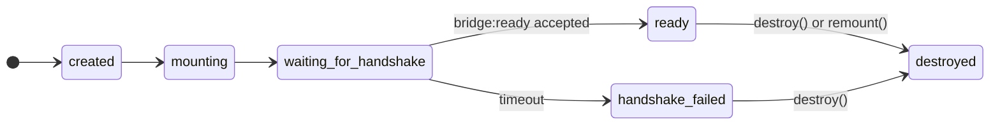

# Debugging & Diagnostics

Cross-domain iframes are opaque by design — you can't open the browser's devtools on a parent page and step into the iframe's JavaScript, and the browser gives you nothing when `postMessage` calls are silently dropped. The SDK gives you a window into what's happening: handshake details, message filtering decisions, configuration warnings, and listener errors.

**Diagnostics are opt-in through logger hooks.** Without hooks, the SDK stays silent. When hooks are configured, every diagnostic event carries a level (`debug`, `warn`, or `error`), a human-readable message, an optional code, sanitized metadata, and the bridge session id. Logger hooks are observational — if a hook throws, the SDK catches the failure and the bridge continues operating.

---

## Using the Diagnostic Recorder

`createDiagnosticRecorder()` is a batteries-included helper for local debugging. It captures every event the SDK emits, stamps them with a sequence number and timestamp, and keeps a bounded ring buffer you can inspect at any time.

### Basic setup

```ts
import {
  createDiagnosticRecorder,
  createIframeBridge,
} from '@furkankaynak/iframe-helper-sdk';

const recorder = createDiagnosticRecorder({ maxEntries: 100 });

const bridge = createIframeBridge({
  container: '#frame-root',
  src: 'https://partner.example/app',
  diagnostics: {
    debug: true,
    logger: recorder.logger,
  },
});

await bridge.whenReady();

// Dump everything to the console as a sortable table
console.table(recorder.entries);
```

Output in the console:

```
┌─────────┬─────────┬───────┬───────────────┬──────────────────────────────────┐
│ (index) │ level   │ seq   │ code          │ message                          │
├─────────┼─────────┼───────┼───────────────┼──────────────────────────────────┤
│ 0       │ 'debug' │ 1     │ undefined     │ 'Bridge created.'                │
│ 1       │ 'debug' │ 2     │ undefined     │ 'Mounting iframe.'               │
│ 2       │ 'debug' │ 3     │ undefined     │ 'Waiting for bridge:ready.'      │
│ 3       │ 'debug' │ 4     │ undefined     │ 'Accepted bridge:ready.'         │
│ 4       │ 'debug' │ 5     │ undefined     │ 'Sent bridge:connected.'         │
│ 5       │ 'debug' │ 6     │ undefined     │ 'Flushing pre-ready queue.'      │
└─────────┴─────────┴───────┴───────────────┴──────────────────────────────────┘
```

### Entry shape

Each entry is a frozen object combining the original `DiagnosticEvent` with recorder metadata:

```ts
type DiagnosticRecorderEntry = Readonly<{
  // From DiagnosticEvent
  message: string;
  code?: string;
  details?: unknown;
  sessionId?: string;

  // Added by the recorder
  level: 'debug' | 'warn' | 'error';
  sequence: number;
  timestamp: number;
}>;
```

`sequence` starts at 1 and increments monotonically across all events. `timestamp` is a `Date.now()` epoch millisecond value captured when the event was recorded.

### Options

```ts
type DiagnosticRecorderOptions = {
  readonly maxEntries?: number;
};
```

| Option         | Default       | Behavior                                                                                     |
| -------------- | ------------- | -------------------------------------------------------------------------------------------- |
| `maxEntries`   | unbounded     | When set and exceeded, the oldest entries are evicted. Must be a non-negative integer.       |
| _(no option)_  | —             | Without `maxEntries`, the recorder grows indefinitely — fine for short-lived debugging.      |

If `maxEntries` is not a valid non-negative integer, `createDiagnosticRecorder` throws `DIAGNOSTICS_INVALID_MAX_ENTRIES` synchronously.

### Clearing the recorder

```ts
recorder.clear();
```

Removes all entries without changing the logger wiring. New events continue to be captured after clearing.

:::tip Freeze protection

Both `recorder.entries` and each individual entry are frozen with `Object.freeze`. This prevents accidental mutation during inspection. If you need a mutable copy, spread or destructure the entry.

:::

---

## Custom Logger Hooks

The recorder is convenient for local work, but in production you'll want diagnostics flowing into your existing logging infrastructure. Pass your own logger to `diagnostics.logger` instead.

### Logger shape

```ts
type IframeBridgeLogger = {
  debug?(event: DiagnosticEvent): void;
  warn?(event: DiagnosticEvent): void;
  error?(event: DiagnosticEvent): void;
};
```

Each hook is optional. If a hook is missing, events at that level are silently dropped. If a hook throws, the SDK catches the error and the bridge continues — diagnostics never break the bridge.

### Console logger

```ts
import { createIframeBridge } from '@furkankaynak/iframe-helper-sdk';
import type { DiagnosticEvent } from '@furkankaynak/iframe-helper-sdk';

const bridge = createIframeBridge({
  container: '#frame-root',
  src: 'https://partner.example/app',
  diagnostics: {
    logger: {
      debug(event) {
        console.debug('[iframe-bridge]', event.message, event);
      },
      warn(event) {
        console.warn(`[iframe-bridge] ${event.code ?? event.message}`, event.details);
      },
      error(event) {
        console.error(`[iframe-bridge] ${event.code ?? event.message}`, event.details);
      },
    },
  },
});
```

### Structured logging

```ts
const bridge = createIframeBridge({
  container: '#frame-root',
  src: 'https://partner.example/app',
  diagnostics: {
    logger: {
      warn(event) {
        // Route warnings to your monitoring service
        analytics.track('bridge_warning', {
          code: event.code,
          message: event.message,
          details: event.details,
          sessionId: event.sessionId,
        });
      },
      error(event) {
        // Capture errors as structured exceptions
        sentry.captureException(new Error(event.message), {
          tags: { code: event.code, sessionId: event.sessionId },
          extra: { details: event.details },
        });
      },
    },
  },
});
```

:::danger Diagnostics are not telemetry

Diagnostic events are sanitized by design. They do not include raw `postMessage` payloads, application data from event listeners, or the content of deserialization errors. Do not use diagnostic hooks for collecting user data or application-level analytics — use the SDK's `on()` listener for that purpose.

:::

---

## Debug Mode

Debug events include lifecycle transitions, handshake details, queue flushes, and message filtering decisions. They are the most detailed and the most noisy. They are gated behind `diagnostics.debug: true` — without it, only `warn` and `error` events are delivered.

### When to enable

| Scenario                          | Recommendation                  |
| --------------------------------- | ------------------------------- |
| Local development                 | Enable — every detail helps     |
| Integration testing               | Enable — helps spot mismatches  |
| CI / automated tests              | Enable — keep recorder as audit |
| Production with monitoring        | Disable — noise outweighs value |
| Production debugging an incident  | Enable temporarily via config   |

### What you get with debug

- Bridge creation, iframe mounting, and when the message listener is installed
- Every accepted `bridge:ready` and sent `bridge:connected`
- Queue flush progress (how many operations were drained)
- Message filtering decisions — origin mismatches, session mismatches, source mismatches, invalid envelopes
- Bridge destruction and listener cleanup

### Enabling debug

```ts
const bridge = createIframeBridge({
  container: '#frame-root',
  src: 'https://partner.example/app',
  diagnostics: {
    debug: true, // Required: gates all debug-level events
    logger: {
      debug(event) {
        console.debug('[iframe-bridge:debug]', event.message, event);
      },
    },
  },
});
```

Both `diagnostics.debug: true` and a `logger.debug` hook must be present. If either is missing, debug events are skipped.

:::warning Debug mode is verbose

A single successful handshake produces half a dozen debug events. With multiple bridges or frequent remounts, the volume can be significant. Use `createDiagnosticRecorder` with a `maxEntries` to bound memory, or wire only the levels you need.

:::

---

## Inspecting Bridge State

`bridge.state` is a read-only string property that reflects the current lifecycle state. You can poll it for status displays, guard UI interactions, or log it from a diagnostic hook.

```ts
type LifecycleState =
  | 'created'        // Factory called, config validated
  | 'mounting'        // Container resolved, iframe element attached
  | 'waiting_for_handshake'  // Listening for bridge:ready
  | 'ready'           // Handshake complete, communication active
  | 'handshake_failed' // Timer expired without a valid ready
  | 'destroyed';      // destroy() called, all listeners removed
```



### Tracking state changes

There's no state-change event. Track it by polling `bridge.state` or by observing diagnostic events:

```ts
const states: string[] = [];
let lastState = bridge.state;
states.push(lastState);

const interval = setInterval(() => {
  if (bridge.state !== lastState) {
    lastState = bridge.state;
    states.push(lastState);
    console.log('Bridge state:', lastState);
  }
}, 50);

bridge.whenReady().finally(() => clearInterval(interval));
```

A simpler approach — watch for the key transitions through diagnostics:

```ts
const bridge = createIframeBridge({
  container: '#frame-root',
  src: 'https://partner.example/app',
  diagnostics: {
    debug: true,
    logger: {
      debug(event) {
        if (event.message.startsWith('Accepted') || event.message.startsWith('Handshake failed')) {
          console.log(`[bridge] ${event.message} — state is now "${bridge.state}"`);
        }
      },
    },
  },
});
```

### What state tells you

| State                    | `request` works? | `sendEvent` works? | `on()` listeners fire? |
| ------------------------ | ---------------- | ------------------ | ---------------------- |
| `created` / `mounting`   | Queued only      | Queued only        | Registered, not active |
| `waiting_for_handshake`  | Queued only      | Queued only        | Registered, not active |
| `ready`                  | Yes              | Yes                | Yes                    |
| `handshake_failed`       | Rejects          | Rejects            | No                     |
| `destroyed`              | Rejects          | Rejects            | No                     |

Operations called before `ready` are queued when `queue.enabled` is `true` (default). When the queue is disabled, those operations reject with `BRIDGE_NOT_READY` immediately.

---

## Common Diagnostic Codes

Diagnostic codes are metadata on `DiagnosticEvent.code` — they help you filter, search, and route events. Some codes overlap with `IframeBridgeErrorCode`, but diagnostic codes are not limited to thrown errors.

| Code                               | Level   | Meaning                                                              | Typical cause                                       |
| ---------------------------------- | ------- | -------------------------------------------------------------------- | --------------------------------------------------- |
| `EVENT_LISTENER_ERROR`             | error   | A user-registered `on()` listener threw.                             | Unhandled error in your event handler.              |
| `MESSAGE_DESERIALIZATION_ERROR`    | error   | Browser fired `messageerror` for a postMessage the SDK expected.     | Non-structured-cloneable data from the iframe.      |
| `MESSAGE_ORIGIN_MISMATCH`          | debug   | Incoming message origin didn't match `allowedOrigin`.                | Another page posting on the same channel, or `allowedOrigin` misconfigured. |
| `MESSAGE_SESSION_MISMATCH`         | debug   | Incoming message had a different session id.                         | Another bridge instance's messages, or stale iframe messages after remount. |
| `MESSAGE_SOURCE_MISMATCH`          | debug   | Incoming message came from a window that isn't the owned iframe.     | Nested iframes or third-party scripts posting messages. |
| `MESSAGE_INVALID_ENVELOPE`         | debug   | Message matched transport but failed envelope validation.            | Protocol name, version, type, or required fields don't match the spec. |
| `CONFIG_UNSAFE_SANDBOX`            | warn    | Sandbox combines `allow-scripts` with `allow-same-origin`.           | Intentional for some integrations; surfaces as a warning so you can review. |
| `CONFIG_UNSAFE_PERMISSIONS_POLICY` | warn    | `iframeAttributes.allow` uses wildcard feature grants.               | `allow="*"` or broad permission grants; narrow to specific features. |

:::tip Diagnose handshake failures

When the bridge reaches `handshake_failed`, check the diagnostic recorder for `MESSAGE_ORIGIN_MISMATCH`, `MESSAGE_SESSION_MISMATCH`, and `MESSAGE_INVALID_ENVELOPE` entries. They tell you why the SDK rejected the iframe's `bridge:ready` messages — if any arrived at all. See [Troubleshooting](./troubleshooting) for a step-by-step diagnostic flow.

:::

---

## Manual Playground

The repository includes a working cross-origin example that uses the diagnostic recorder. You can run it locally to see every event the SDK emits during a real handshake.

```bash
# Build the library first (required — the parent imports the built package)
npm run build

# Start the parent and iframe dev servers (run each in a separate terminal)
npm run example:manual:parent
npm run example:manual:iframe
```

Open the parent app at [http://127.0.0.1:5173/](http://127.0.0.1:5173/).

The parent serves `playground/manual/parent` on port 5173 and imports the SDK from the built `dist/` output. The iframe serves `playground/manual/iframe` on port 5174 and implements the raw bridge protocol directly — it does not import this SDK.

Once loaded, the parent page:

1. Creates a bridge with `diagnostics.debug: true` and logs all entries with `console.table`.
2. Displays the current lifecycle state in real time.
3. Provides buttons to send events and requests once the bridge is ready.
4. Lets you remount the iframe and watch the full lifecycle repeat.

Open the browser console and the network tab to see the diagnostic entries, protocol messages in `postMessage` events, and the bridge state transitions.

:::tip Local debugging workflow

1. Open the parent page and open devtools.
2. Watch the console table of diagnostic entries — confirm `created → mounting → waiting_for_handshake → ready`.
3. If the handshake fails, check the diagnostic codes in the console — an origin mismatch or session mismatch usually points to a bootstrap config issue.
4. Click the "Send analytics event" and "Request user" buttons to see request/response lifecycle diagnostics.
5. Click "Explicit remount" to watch the full lifecycle repeat.

:::

---

## Next Steps

- **[Troubleshooting](./troubleshooting)** — Step-by-step diagnostic flows for handshake failures, origin mismatches, and CSP issues.
- **[Configuration](./configuration)** — Full reference for every option used in these examples, including `diagnostics.debug`, `diagnostics.logger`, and `bootstrap`.
- **[API Reference](./api-reference)** — Hand-written reference for `createDiagnosticRecorder`, `DiagnosticRecorder`, `DiagnosticRecorderEntry`, and all other public exports.
- **[Error Codes](./error-codes)** — Complete error code table with recovery actions.
- **[Use Cases & Recipes](./use-cases)** — Copy-pasteable configuration recipes that include diagnostic recorder setup.
